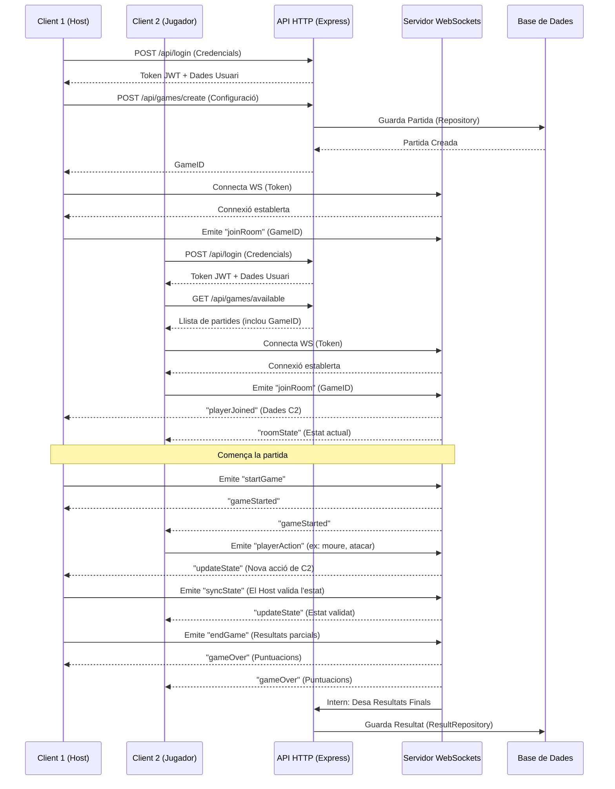
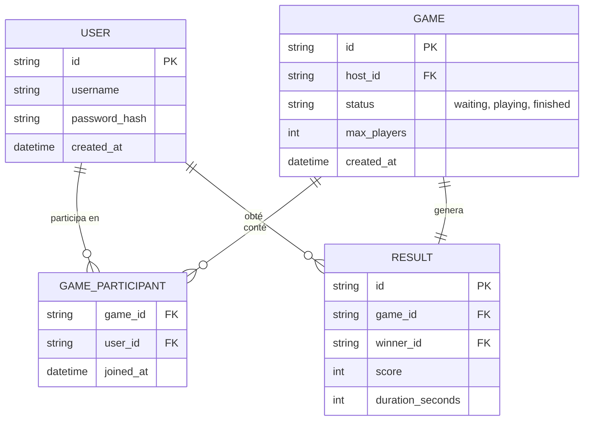

# Diagrames del Projecte

Aquest document recull els principals diagrames que defineixen l'arquitectura i el funcionament del videojoc multijugador.

## 1. Diagrama de Casos d'Ús

Aquest diagrama mostra les interaccions principals del jugador amb el sistema, incloent l'autenticació, la gestió de partides i el joc mateix.

```mermaid
usecaseDiagram
    actor Jugador as "Jugador"
    
    package "Sistema Multijugador" {
        usecase UC1 as "Identificar-se / Login"
        usecase UC2 as "Configurar paràmetres bàsics"
        usecase UC3 as "Crear nova partida"
        usecase UC4 as "Unir-se a partida existent"
        usecase UC5 as "Jugar partida (Temps real/Torns)"
        usecase UC6 as "Consultar resultats finals"
    }

    Jugador --> UC1
    Jugador --> UC2
    Jugador --> UC3
    Jugador --> UC4
    Jugador --> UC5
    Jugador --> UC6
    
    UC3 ..> UC1 : include
    UC4 ..> UC1 : include
    UC5 ..> UC3 : extends
    UC5 ..> UC4 : extends
```

## 2. Diagrama de Seqüència (Connexió, Creació de Partida i Joc amb WebSockets)

Aquest diagrama il·lustra el procés de creació i unió a una partida, equivalent al procés de "reserva" d'una sala i el desenvolupament del joc, fent ús de peticions HTTP i WebSockets/Socket.IO per a la comunicació en temps real.



## 3. Diagrama Entitat-Relació

Estructura de les dades persistents de l'aplicació, gestionades mitjançant el patró Repository.



## 4. Diagrama de Microserveis

Arquitectura del backend en Node.js, destacant la separació de responsabilitats i l'ús del proxy invers.

```mermaid
graph TD
    Client[Unity Client] --> |HTTP / WebSockets| Proxy[API Gateway / Proxy Invers]
    
    Proxy --> |Rutes /api/users| AuthService[Servei d'Usuaris i Auth]
    Proxy --> |Rutes /api/games| GameService[Servei de Partides i API]
    Proxy --> |Connexió WS| WSService[Servei WebSockets en Temps Real]
    
    AuthService --> UserRepository[User Repository]
    GameService --> GameRepository[Game Repository]
    GameService --> ResultRepository[Result Repository]
    WSService -.-> |Comunica fi de partida| GameService
    
    UserRepository --> DB[(Base de Dades Compartida)]
    GameRepository --> DB
    ResultRepository --> DB
    
    subgraph Capa de Persistència (Patró Repository)
        UserRepository
        GameRepository
        ResultRepository
    end
    
    subgraph Microserveis Node.js
        AuthService
        GameService
        WSService
    end
```
